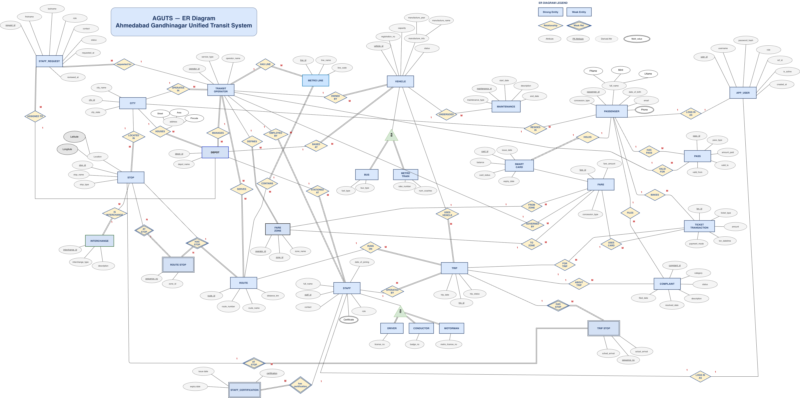
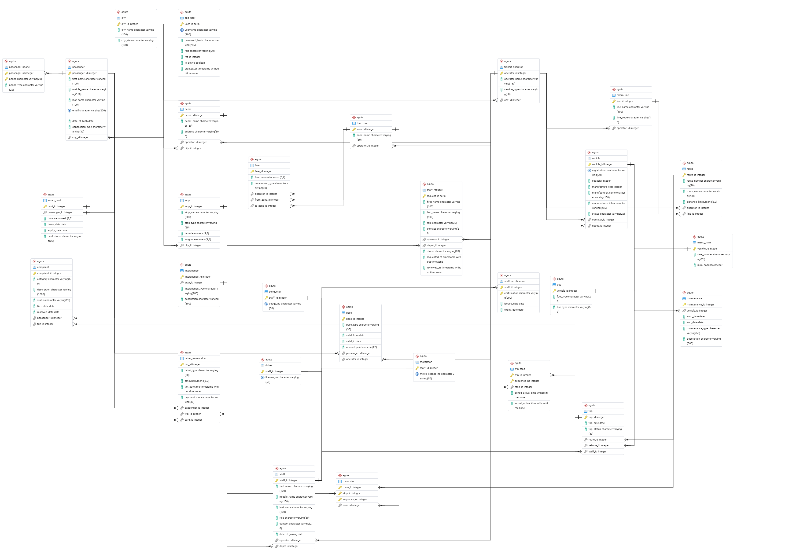

# AGUTS — Ahmedabad Gandhinagar Unified Transit System

> A unified PostgreSQL database system for the multi-modal public transit
> network of Ahmedabad and Gandhinagar — Metro (GMRC), BRTS Janmarg,
> AMTS, and GSRTC — with a role-based C++ console application.

---

## The Problem

Ahmedabad and Gandhinagar run 4 independent transit operators — each
maintaining their own data in isolation. A commuter crossing services
has no unified source for schedules, fares, or journey planning.
Operators have no cross-system visibility into ridership, fleet, or
service performance.

**AGUTS fixes this.**

---

## What It Is

A production-grade relational database system that unifies the entire
Ahmedabad–Gandhinagar transit network into a single, coherent schema —
serving commuters, ticketing agents, staff, depot managers, and
transit administrators.

| Transit Service | Coverage |
|---|---|
| Metro (GMRC) | Line 1 (Vastral ↔ Thaltej Gam), Line 2 (Motera ↔ Mahatma Mandir) |
| BRTS Janmarg | 20+ dedicated corridor routes across Ahmedabad |
| AMTS | 150+ city and suburban routes |
| GSRTC | Inter-city and Gandhinagar-specific services |

---

## Schema

**27 relations — all proven in BCNF**

| Category | Tables |
|---|---|
| Network | City, Transit_Operator, Metro_Line, Fare_Zone, Stop, Interchange, Route, Route_Stop |
| Fleet | Vehicle, Bus, Metro_Train, Maintenance, Depot |
| Staff | Staff, Driver, Conductor, Motorman, Staff_Certification |
| Passengers | Passenger, Passenger_Phone, Smart_Card, Pass |
| Operations | Trip, Trip_Stop |
| Transactions | Fare, Ticket_Transaction, Complaint |

Key design decisions:
- ISA subtypes: Bus/Metro_Train (from Vehicle), Driver/Conductor/Motorman (from Staff)
- Weak entities: Route_Stop (3-part PK), Trip_Stop
- Multi-valued attributes: Passenger_Phone, Staff_Certification
- 1:1 via UNIQUE constraint: Smart_Card, Interchange

---

## ER Diagram



---

## Relational Schema



---

## Console Application

Role-based C++ application using libpq (PostgreSQL C library).

| Role | Capabilities |
|---|---|
| Guest | View operators, routes, fares, fare calculator, register |
| Passenger | Smart card balance, travel history, book ticket, file complaint, buy pass, recharge |
| Staff | View assigned trips, certifications |
| Admin | Full access — all 6 modules, approve staff, resolve complaints |

Features:
- SHA-256 password hashing (OpenSSL)
- Password echo suppression (termios)
- Stored procedure calls for ticket issuance, complaint filing, smart card recharge
- Zone-based fare lookup with concession category awareness
- Staff approval workflow

---

## SQL Queries

**84 queries across 6 scenarios:**

| Scenario | Queries | Coverage |
|---|---|---|
| A: Network & Infrastructure | Q01–Q16 | Routes, stops, zones, interchange points, GPS coordinates |
| B: Schedule & Trip Operations | Q17–Q27 | OTP analysis, delay tracking, trip logs |
| C: Passenger & Smart Card | Q28–Q40 | Travel history, low balance alerts, concession management |
| D: Ticketing & Revenue | Q41–Q53 | Revenue by operator, payment mode, route profitability |
| E: Fleet & Maintenance | Q54–Q69 | Fleet health, maintenance tracking, idle vehicle detection |
| F: Staff & Operations | Q70–Q84 | Duty logs, certification expiry, complaint accountability |

Notable queries: window functions (LEAD), STRING_AGG, multi-table
JOINs (up to 5 tables), CASE WHEN aggregations, date arithmetic,
correlated subqueries.

---

## Normalization

All 27 relations proven in BCNF with full closure computations.
Two relations with dual candidate keys: INTERCHANGE, SMART_CARD.

Full proofs: [`docs/AGUTS_BCNF_Proofs.docx.pdf`](docs/AGUTS_BCNF_Proofs.docx.pdf)

Minimal FD set: [`docs/AGUTS_Minimal_FD_Set.docx.pdf`](docs/AGUTS_Minimal_FD_Set.docx.pdf)

---

## Setup

### Prerequisites
```
PostgreSQL 16+
g++ with libpq-dev and openssl
```

### Database
```bash
psql -U postgres -c "CREATE DATABASE aguts;"
psql -U postgres -d aguts -f sql/DDL_Scripts.sql
psql -U postgres -d aguts -f sql/AGUTS_INSERT_Script.sql
```

### Console App
```bash
g++ src/aguts.cpp -lpq -lssl -lcrypto -o aguts
./aguts
```

---

## Repository Structure

```
AGUTS/
├── docs/
│   ├── ideation.pdf
│   ├── AGUTS_ERD.png
│   ├── aguts_ER_schema_image.png
│   ├── AGUTS_BCNF_Proofs.docx.pdf
│   └── AGUTS_Minimal_FD_Set.docx.pdf
├── sql/
│   ├── DDL_Scripts.sql
│   ├── AGUTS_INSERT_Script.sql
│   └── queries.sql
└── src/
    └── aguts.cpp
```

---

## Team

| Student ID | Name | Role |
|---|---|---|
| 202401195 | Hari Sharma | Group Representative |
| 202401461 | Rudra Bhatt | Member |
| 202401235 | Arjunsinh Vaghela | Member |
| 202401417 | Tirth Ditani | Member |
| 202401423 | Neeti Gunsai | Member |


**Course:** IT214 Database Management System
**Institution:** Dhirubhai Ambani University | Winter 2025–26
